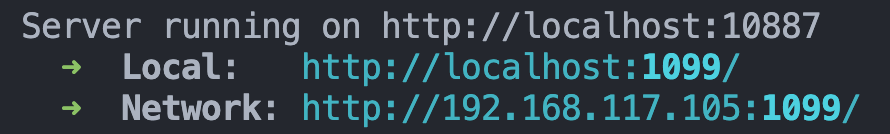

## *Watcher : Your "Eating Cat" is now online!*

### Story
A watcher is observing your cat.
When the cat appears, a 3D particle effect cat will be displayed on the screen.
It can be scaled using gesture recognition through the camera.


## Get Started

### Environment 

- **[Nodejs 18+](https://nodejs.org/en/download/package-manager)**

```shell
node -v
# v18.18.2
```

### Dependencies
- **[Vue3](https://vuejs.org/)**
- **[threejs](https://threejs.org/)**
- **[ml5.js](https://ml5js.org/)**
- **[p5.js](https://p5js.org/)**
- **CSS framework : [Tailwindcss](https://tailwindcss.com/)**
- **UI Component Library**: [TDesign Web Vue UI](https://tdesign.tencent.com/vue/overview)

```shell 
git clone https://github.com/YuechiFu/Watcher-Particles
```
```shell
cd {your_folder_path}/Watcher-Particles
```


### Install Dependencies

```shell  
npm install 
```

### Start web page

- For Development Environment  
    ```shell
    npm run dev 
    ```
    Visit http://localhost:1089/

    

- For Production Environment
    ```shell
    npm run build 
    ```

    ```shell
    npm run preview 
    ```

    Visit http://localhost:1099/

    


It will start a Websocket Server **(http://your_ip_address:10887)** for receiving "Watcher http notification" 


#### Set websocket Url
Set your Websocket Server address (http://your_ip_address:10887)


### Step 2: Create a task for detecting your cat and pushing nofications using the Sensecap App


 A "cat" notification will be sent to your  websocket server (http://your_ip_address:10887) when a cat is detected
After a while, a 3D particle effect cat will appgit ear on the page.
You can zoom and rotate using the mouse.

### Step3: Gesture Control

Use your computer camera or a USB camera in conjunction with gestures to zoom in and out of the 3D model.


